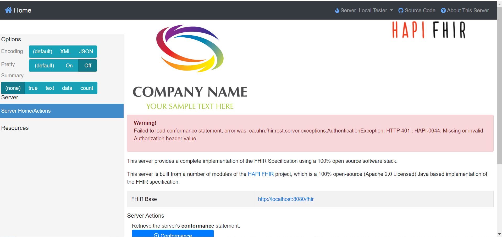
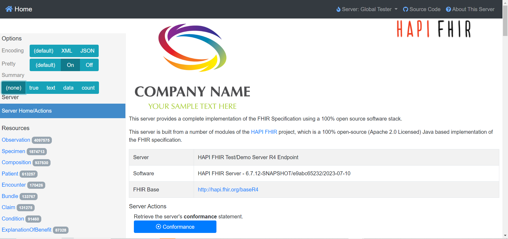

# hapi-fhir-server

## 架設環境

### 資料夾結構

```
ig/
    dms-ig.zip
    attach.py
interceptor/
    src/main/java/org/example/
        BearerAuthInterceptor.java
docker-compose.yml
hapi.application.yaml
```

### Authorization

我們使用 FHIR SERVER 提供的 [Interceptor](https://hapifhir.io/hapi-fhir/docs/interceptors/interceptors.html) 方式實作 Authorization 功能。

首先，我們在 `./interceptor` 建立了一個 Maven 專案用來建立 interceptor。此 interceptor 的路徑為 `org.example.BearerAuthInterceptor`。

目前，此 interceptor 參考 [HAPI FHIR Documentation](https://hapifhir.io/hapi-fhir/docs/security/authorization_interceptor.html) 提供的範例，使用 `39ff939jgg` 作為可存取所有資源的 Bearer token。

```java=
package org.example;

import ca.uhn.fhir.rest.server.interceptor.auth.AuthorizationInterceptor;
import ca.uhn.fhir.rest.server.interceptor.auth.IAuthRule;
import ca.uhn.fhir.rest.server.interceptor.auth.RuleBuilder;
import ca.uhn.fhir.i18n.Msg;
import java.util.List;
import ca.uhn.fhir.rest.api.server.RequestDetails;
import ca.uhn.fhir.rest.server.exceptions.AuthenticationException;

@SuppressWarnings("ConstantConditions")
public class BearerAuthInterceptor extends AuthorizationInterceptor {

    @Override
    public List<IAuthRule> buildRuleList(RequestDetails theRequestDetails) {
        boolean userIsAdmin = false;
        String authHeader = theRequestDetails.getHeader("Authorization");

        if ("Bearer 39ff939jgg".equals(authHeader)) {
            // This user has access to everything
            userIsAdmin = true;
        } else {
            // Throw an HTTP 401
            throw new AuthenticationException(Msg.code(644) + "Missing or invalid Authorization header value");
        }

        // If the user is an admin, allow everything
        if (userIsAdmin) {
            return new RuleBuilder()
                    .allowAll()
                    .build();
        }

        // By default, deny everything.
        return new RuleBuilder()
                .denyAll()
                .build();
    }
}

```

使用 `mvn compile` 編譯完成後，intercetor 的 class 檔案就會出現在 `./interceptor/target/classes` 資料夾中。

### FHIR Server

#### hapi.application.yaml

```yaml=
spring:
datasource:
url: "jdbc:postgresql://db:5432/hapi"
username: admin
password: admin
driverClassName: org.postgresql.Driver
jpa:
properties:
hibernate.dialect: ca.uhn.fhir.jpa.model.dialect.HapiFhirPostgres94Dialect
hibernate.search.enabled: false
hapi:
fhir:
# 使用 interceptor 專案中編譯後位於 ./interceptor/target/classes 的 class 檔案，
# 由 docker-compose.yml 中 `hapi-extra-classes` 設定將檔案傳送至 FHIR Server 容器中
# `/app/extra-classes`
custom-bean-packages: org.example
custom-interceptor-classes: org.example.BearerAuthInterceptor
```

#### docker-compose.yml

`fhir` 為 FHIR Server；`db` 為 PostgreSQL 資料庫。

```yaml=
version: "3.7"

services:
fhir:
container_name: fhir
image: "hapiproject/hapi:latest"
ports:
- "8080:8080"
configs:
- source: hapi
target: /app/config/application.yaml
- source: hapi-extra-classes
target: /app/extra-classes
depends_on:
- db

db:
image: postgres
restart: always
environment:
POSTGRES_PASSWORD: admin
POSTGRES_USER: admin
POSTGRES_DB: hapi
volumes:
- ./hapi.postgress.data:/var/lib/postgresql/data

configs:
hapi:
file: ./hapi.application.yaml
hapi-extra-classes:
# Compile the interceptor project first
file: ./interceptor/target/classes
```

---

##### 啟動指令

```
docker compose up
```

##### 關閉指令

```
docker compose down
```

### 上傳 IG

我們使用 https://silcoet.ntunhs.edu.tw/DMS-IG/toc.html 的 IG Profile。需要用到的檔案已經放在 `./ig/dms-ig.zip`，需要先解壓縮。

我們建立了 `attach.py` 透過 FHIR Server 提供的 HTTP API 上傳IG檔案。執行這個程式需要設定兩個環境變數：`BASE_URL` 為 FHIR SERVER 的URL，`TOKEN` 為傳送至 FHIR SERVER 的 Bearer Token。

> 需使用 `pip install requests` 安裝 `requests` 套件

```python
#!/usr/bin/env python3

import json
import os
import requests

base_url = os.environ['BASE_URL']
token = os.environ['TOKEN']

def upload(directory: str, resource_type: str):
for entry in os.scandir(directory):
if not (entry.is_file() and entry.name.endswith(".json")):
continue
print(f"Processing {entry.name}")

headers = {
    "Authorization": f"Bearer {token}",
    "Content-Type": "application/fhir+json;charset=UTF-8"
}

with open(entry, mode="r", encoding="utf-8") as source:
data = source.read().encode('utf8')
read_id = json.loads(data)['id']

requests.put(f"{base_url}/{resource_type}/{read_id}", data, headers=headers)


if __name__ == '__main__':
upload("./dms-ig/profiles", "StructureDefinition")
upload("./dms-ig/parameters", "SearchParameter")
upload("./dms-ig/values", "ValueSet")
print("Done!")
```

`attach.py` 中定義了 `upload()`，此函式的參數 `directory` 為包含IG JSON檔案的資料夾路徑，`resource_type` 則是要上傳的資源的 endpoint。目前，`attach.py` 會分別從 dms-ig 資料夾下取得 IG 檔案 (JSON)，資料夾的格式如下：

```
profiles/
# StructureDefinition 檔案
parameters/
# SearchParameter 檔案
values/
# ValueSet 檔案
```

FHIR Server地端



FHIR Server雲端


